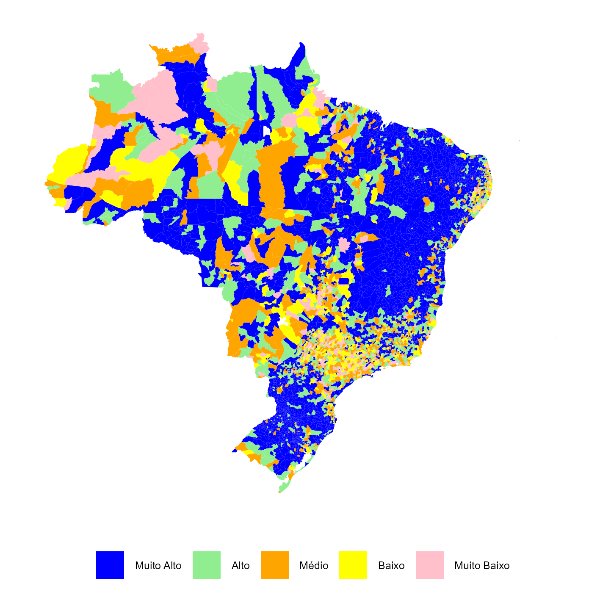
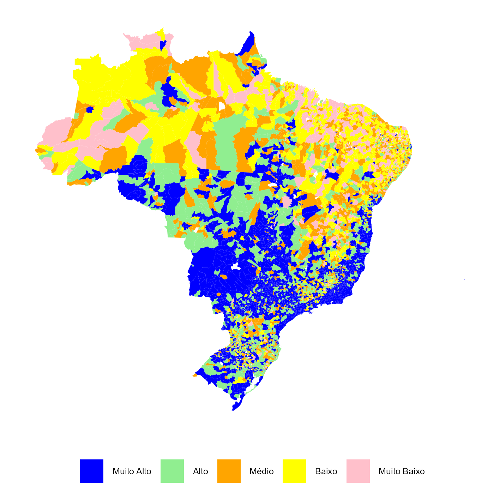

# Área de Atuação das OSCs {#cap-area-atuacao}

```{r setup cap finalidade, echo=FALSE, warning=FALSE, message=FALSE}
library(gt)
library(tidyverse)
library(ggplot2)
library(ggpmisc) # informações estatísticas adicionais aos gráficos
```


Esta seção trata sobre as áreas de atuação das Organizações da Sociedade Civil - OSCs. 

&nbsp;

*Tabela 5.1 - Número de OSCs, segundo a finalidade de atuação: Brasil* 


```{r table OSC_AreaSubAreaAtuacao, echo=FALSE, warning=FALSE}
OSC_AreaSubAreaAtuacao <- readRDS("tables/OSC_AreaSubAreaAtuacao.RDS")

# Formata tabela:
OSC_AreaSubAreaAtuacao %>%
  gt(locale = "pt-BR",
     groupname_col = "tx_area_atuacao") %>%

  # Nomes amigáveis das Colunas
  cols_label(
    tx_subarea_atuacao = "Áreas de Atuação",
    FreqSubArea = "Total de OCSs",
    Per = "Em relação ao total",
    PerGrupo = "Em relação ao  grupo"
  ) %>%

  # Deixa o Nome das Colunas em negrito e centralizado.
  tab_style(
    style = cell_text(weight = "bold", align = "center"),
    locations = cells_column_labels()
  ) %>%

  # Cria grupos de variáveis (spanners)
  tab_spanner(
    label = "(%)",
    columns = c(Per, PerGrupo)
  ) %>%

  # Formata os números da tabela
  fmt_number(
    columns = FreqSubArea,
    sep_mark = ".",
    dec_mark = ",",
    decimals = 0
  ) %>%

  # Intentação nos dados
  tab_style(
    style = cell_text(indent = px(20)),
    locations = cells_body()
  ) %>%

  # Torna as áreas de atuação mais destacadas
  tab_style(
    style = cell_text(weight = "bold"), # Negrito
    locations = cells_row_groups()
  ) %>% 
  
  # Fonte dos dados
  tab_source_note(
    source_note = md("**Nota:** Dados atualizados até fevereiro 2025.<br>
                     **Fonte:** Mapa das Organizações da Sociedade Civil.<br>
                     Elaboração do IPEA.")
  )

```


&nbsp;

*Figura 5.1 - Densidade de OSCs de desenvolvimento e defesa de direitos e interesses por mil habitantes, por município*

```{r, echo = FALSE, warning=FALSE} 


```


&nbsp;

*Figura 5.2 - Densidade de OSCs de Religiosas por mil habitantes, por município*

```{r, echo = FALSE, warning=FALSE} 


```
