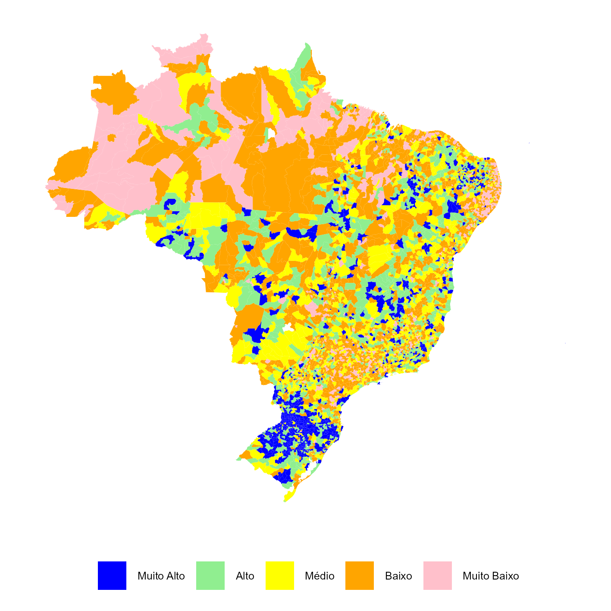

--- 
title: "O Perfil das Organizações Da Sociedade Civil no Brasil (2016-2025)"
author: "Instituto de Pesquisa Econômica Aplicada"
date: "`r Sys.Date()`"
lang: "pt-br"
site: bookdown::bookdown_site
output: bookdown::gitbook
documentclass: book
bibliography: [book.bib, packages.bib]
biblio-style: apalike
link-citations: yes
github-repo: rstudio/bookdown-demo
description: "Relatório Quantitativo do sobre o Mapa das Organizações da Sociedade Civil do Brasil. IPEA - Governo Federal."
always_allow_html: yes
---

# Apresentação {#cap-apresentacao}

Placeholder


<!--chapter:end:index.Rmd-->

# Introdução {#cap-intro}

O Instituto de Pesquisa Econômica Aplicada – Ipea, desde 2016, é o responsável legal pela identificação, organização e gestão de estatísticas públicas referentes às Organizações da Sociedade Civil - OSCs por meio da plataforma digital Mapa das Organizações da Sociedade Civil -MOSC. A proposição desta plataforma digital foi definida no Decreto nº 8.726/2016, que regulamenta a Lei nº 13.019/2014, conhecida como Marco Regulatório das OSCs - MROSC, que fornece diretrizes legais para a atuação das OSCs no Brasil.

O MOSC é uma plataforma colaborativa, pública e gratuita, que centraliza informações e estudos sobre diversos temas relacionados à atuação das OSCs, como, por exemplo, a localização geográfica, recursos financeiros, força de trabalho, projetos, dentre outros. Nele, cada OSC possui uma página individual para a inserção de informações autodeclaradas, que complementam outros dados cadastrais oriundos de fontes de dados públicas, como Cadastro Nacional da Pessoa Jurídica - CNPJ, base principal do MOSC, a Relação Anual de Informações Sociais - RAIS e outras fontes de dados setoriais.

Originalmente, o Ipea atualizava a base cadastral do MOSC a cada dois anos [@pereira2021MOSC], porém, devido a avanços no fluxo de obtenção e processamento dos dados, a atualização tem sido feita mais de uma vez por ano. A fonte principal dos dados MOSC é a base de dados pública do CNPJ, disponibilizada pela Receita Federal no Brasil -RFB.

Todavia, nos dados da RFB, a Natureza Jurídica das organizações ainda não apresenta uma classificação direta que possibilite identificar OSCs, o que leva a necessidade da criação de um mecanismo para identificação indireta dessas entidades. A identificação de OSCs no Mapa é realizada com base em critérios internacionalmente preestabelecidos, que levam em consideração um conjunto de fatores: naturezas jurídicas específicas, atividades econômicas, razão social e certificações, que serão detalhados nesta publicação. Esses critérios foram discutidos em publicações do Instituto Brasileiro de Geografia e Estatística -IBGE sobre as Fundações Privadas e Associações sem Fins Lucrativos no Brasil -Fasfil, na publicação conhecida como COPNI (Classification of the Purposes of Non-Profit Institutions Serving Households) da Organização das Nações Unidas – ONU, bem como em publicações do Ipea [@lopez2018perfil; @pereira2021MOSC].

Esses critérios são sistematizados por meio de filtros de natureza jurídica, classificação de atividade econômica e busca textual nos campos de razão social, constituindo um algoritmo de identificação de OSCs. Esse algoritmo, a cada edição do MOSC, é revisado, aprimorado e sua metodologia de cálculo é divulgada seja no site do MOSC seja por meio de publicações.

<!--chapter:end:01-intro.Rmd-->


# Metodologia {#cap-metodologia}

Placeholder


## Fonte de Dados e Metodologia de Identificação das OSCs
## O Algoritmo de Identificação das OSCs

<!--chapter:end:02-metodologia.Rmd-->

# As OSCs no Território {#cap-territorio}

```{r setup cap territorio, echo=FALSE, warning=FALSE, message=FALSE}
library(gt)
library(tidyverse)
library(ggplot2)
library(ggpmisc) # informações estatísticas adicionais aos gráficos
```

Esta seção trata da distribuição regional e estadual das Organizações da Sociedade Civil - OSCs, a densidade de organizações no território, seus graus de concentração e a presença nas capitais, bem como os Índices de Desenvolvimento Humano - IDH das regiões em que estão localizadas.

&nbsp;

*Tabela 4.1 - Número e percentual de OSCs, segundo as Grandes Regiões e as Unidades da Federação* 

```{r table-FreqOSC, echo=FALSE, warning=FALSE}

JoinFreqOSC <- readRDS("tables/tblJoinFreqOSC.RDS")

# Formata tabela:
JoinFreqOSC %>%
  select(UF_Nome, Freq, Per, Pop, PerPop, OscP1000, Agregacao) %>%
  gt(locale = "pt-BR") %>%
  
  # Esta coluna não aparece nos dados, só serve para diferenciar as regiões
  cols_hide(Agregacao) %>% 
  
  # Nomes amigáveis das Colunas
  cols_label(
    UF_Nome = html("Grandes Regiões e Unidades da Federação"),
    Freq = "Total",
    Per = "(%)",
    Pop = "Total",
    PerPop = "(%)",
    OscP1000 = html("OSCs por mil habitantes")
  ) %>%
  
  # Deixa o Nome das Colunas em negrito e centralizado.
  tab_style(
    style = cell_text(weight = "bold", align = "center"),
    locations = cells_column_labels()
  ) %>% 
  
  # Formata os números da tabela
  fmt_number(
    columns = c(Per, PerPop, OscP1000), 
    decimals = 1
    ) %>% 
  fmt_number(
    columns = c(Freq, Pop), 
    sep_mark = ".",
    decimals = 0
  ) %>% 
  
  # Centraliza os dados das tabelas
  tab_style(
    style = cell_text(align = "center"),
    locations = cells_body(
      columns = !UF_Nome )
  ) %>% 
  
  # Cria grupos de variáveis (spanners)
  tab_spanner(
    label = "OSCs",
    columns = c(Freq, Per)
  ) %>%
  tab_spanner(
    label = "População",
    columns = c(Pop, PerPop)
  ) %>%
  
  # Torna as regiões mais destacadas
  tab_style(
    style = cell_text(indent = px(20)), # Intentação
    locations = cells_body(
      columns = UF_Nome,
      rows = Agregacao ==  "UF")
  ) %>% 
  tab_style(
    style = cell_text(weight = "bold"), # Negrito
    locations = cells_body(
      columns = everything(),
      rows = Agregacao !=  "UF")
  ) %>% 
  
  # Largura das Colunas
  cols_width(c(Freq, Pop) ~ px(100),
             c(Per, PerPop, OscP1000) ~ px(90), 
             UF_Nome ~ px(180)) %>% 
  
  # Fonte dos dados
  tab_source_note(
    source_note = md("**Nota:** Dados atualizados até Fevereiro 2025.<br>
                     **Fonte:** Mapa das Organizações da Sociedade Civil.<br>
                     Elaboração do IPEA.")
  )

```

&nbsp;

*Gráfico 4.1 - Número de OSCs por mil habitantes, por Grandes Regiões e Unidades da Federação*

Média nacional representada pela linha vermelha.

```{r plot OscP1000, echo = FALSE} 
JoinFreqOSC <- readRDS("tables/tblJoinFreqOSC.RDS")

OscP1000MeanBR <- sum( (JoinFreqOSC$PerPop * JoinFreqOSC$OscP1000) ) / 100

JoinFreqOSC %>%
  select(UF_Nome, UF_Id, OscP1000, Agregacao) %>%
  dplyr::filter(UF_Nome != "Total") %>% 
  arrange(UF_Id) %>%
  mutate(UF_Nome = fct_reorder(UF_Nome, UF_Id) ) %>%
  ggplot(aes(x = UF_Nome, y = OscP1000, fill = Agregacao)) +
  geom_bar(stat="identity", color="black", position=position_dodge()) +
  scale_fill_manual(values = c("lightgreen", "steelblue")) +
  geom_hline(yintercept = OscP1000MeanBR, linetype="dashed",
             color = "red", linewidth= 1) +
  theme_minimal() +
  theme(axis.text.x = element_text(angle = 90, vjust = 0.5, hjust=1) ,
        axis.title.x = element_blank(),
        axis.title.y = element_blank(),
        legend.position="none")

```

&nbsp;

*Tabela 4.2 - Número de OSCs, OSCs por mil habitantes e percentual de OSCs nas capitais do país*

```{r tab OscPerCap, echo = FALSE} 
OscPerCap <- readRDS("tables/OscPerCap.RDS")

# Formata tabela:
OscPerCap %>%
  gt(locale = "pt-BR") %>%

  # Omite colunas
  cols_hide(c(CapNome, cd_capital)) %>%

  # Coloca o valor missing de crescimento no primeiro ano em formato amigável
  sub_missing(
    missing_text = "-"
  ) %>%

  # Nomes amigáveis das Colunas
  cols_label(
    CapitalUF = "Capitais",
    FreqCap = "Capital",
    Freq = "UF",
    PerCap = "Capital (%)",
    PopCap = "Capital",
    Pop = "UF",
    PerPopCap = "Capital (%)",
    OscCapP1000 = "Capital",
    OscP1000 = "UF"
  ) %>%

  # Deixa o Nome das Colunas em negrito e centralizado.
  tab_style(
    style = cell_text(weight = "bold", align = "center"),
    locations = cells_column_labels()
  ) %>%

  # Centraliza os dados das tabelas
  tab_style(
    style = cell_text(align = "center"),
    locations = cells_body(
      columns = !CapitalUF )
  ) %>%

  # Destaca os totais
  tab_style(
    style = cell_text(weight = "bold"),
    locations = cells_body(
      rows =  CapitalUF == "Totais")
  ) %>%

  # Formata os números da tabela
  fmt_number(
    columns = c(PerCap, PerPopCap, OscCapP1000, OscP1000),
    decimals = 1
  ) %>%

  fmt_number(
    columns = c(FreqCap, Freq, Pop),
    sep_mark = ".",
    decimals = 0
  ) %>%

  # Cria grupos de variáveis (spanners)
  tab_spanner(
    label = "OSCs",
    columns = c(FreqCap, Freq, PerCap)
  ) %>%
  tab_spanner(
    label = "População",
    columns = c(PopCap, Pop, PerPopCap)
  ) %>%
  tab_spanner(
    label = "OSCs por mil habitantes",
    columns = c(OscCapP1000, OscP1000)
  ) %>% 
  
  # Fonte dos dados
  tab_source_note(
    source_note = md("**Nota:** Dados atualizados até Fevereiro 2025.<br>
                     **Fonte:** Mapa das Organizações da Sociedade Civil.<br>
                     Elaboração do IPEA.")
  )

```

&nbsp;

*Gráfico 4.2 - Habitantes e OSCs nas capitais em relação ao total da população e OSCs da UF*

```{r plot OscPerCap, echo = FALSE} 
OscPerCap <- readRDS("tables/OscPerCap.RDS")

OscPerCap %>%
  dplyr::filter(CapitalUF != "Totais") %>% 
  select(CapNome, PerCap, PerPopCap) %>%
  mutate(CapNome = fct_reorder(CapNome, PerCap, .desc = TRUE) ) %>%
  gather(Agregacao, Percentual, PerCap:PerPopCap) %>%
  mutate(Agregacao = ifelse(Agregacao == "PerCap", "OSCs na Capital",
                             "População da UF na capital") ) %>%
  ggplot(aes(x = CapNome, y = Percentual, fill = Agregacao)) +
  geom_bar(stat="identity", color="black", position=position_dodge()) +
  scale_fill_brewer(palette="Blues") +
  theme_minimal() +
  theme(axis.text.x = element_text(angle = 90, vjust = 0.5, hjust=1) ,
        axis.title.x = element_blank(),
        axis.title.y = element_blank(),
        legend.title = element_blank(),
        legend.position = "bottom" )

```


&nbsp;

*Tabela 4.3 - Número de OSCs, densidade de organizações por mil habitantes e IDHM nas capitais dos estados*

```{r tab OSCCapIDH_1, echo = FALSE} 
OSCCapIDH <- readRDS("tables/OSCCapIDH.RDS")

# Formata tabela:
OSCCapIDH %>%
  gt(locale = "pt-BR") %>%

  # Esta coluna não aparece nos dados, só serve para diferenciar as regiões
  cols_hide(cd_capital) %>%

  # Nomes amigáveis das Colunas
  cols_label(
    CapNome = "Nome da Capital",
    FreqCap = "OSCs",
    OscCapP1000 = "OSCs por mil habitantes",
    IDH2010 = "IDHM"
  ) %>%

  # Deixa o Nome das Colunas em negrito e centralizado.
  tab_style(
    style = cell_text(weight = "bold", align = "center"),
    locations = cells_column_labels()
  ) %>%

  # Formata os números da tabela
  fmt_number(
    columns = c(OscCapP1000, IDH2010),
    decimals = 1
  ) %>%
  fmt_number(
    columns = c(FreqCap),
    sep_mark = ".",
    decimals = 0
  ) %>%

  # Centraliza os dados das tabelas
  tab_style(
    style = cell_text(align = "center"),
    locations = cells_body(
      columns = !CapNome )
  ) %>% 
  
  # Fonte dos dados
  tab_source_note(
    source_note = md("**Nota:** Dados atualizados até Fevereiro 2025.<br>
                     **Fonte:** Mapa das Organizações da Sociedade Civil.<br>
                     Elaboração do IPEA.")
  )


```

&nbsp;

*Gráfico 4.3 - Correlação entre a densidade de Organizações por mil habitantes e IDHM nas capitais dos estados*

```{r tab OSCCapIDH_2, echo = FALSE, warning=FALSE} 
OSCCapIDH <- readRDS("tables/OSCCapIDH.RDS")

# Correlação em gráfico
OSCCapIDH %>%
  ggplot(aes(x = IDH2010, y = OscCapP1000)) +
  geom_point() +
  ggpmisc::stat_poly_line() +
  ggpmisc::stat_poly_eq(use_label(c("eq", "R2", "p"))) + 
  theme_classic() + 
  xlab("IDH Municipal das Capitais (2010)") + 
  ylab("OSC por 1000 Habitantes")

```


&nbsp;

*Figura 4.1 - Mapa - Distribuição do IDH Municipal no Território Brasileiro*

```{r map HeatMapIDHMunic, echo = FALSE, warning=FALSE} 
knitr::include_graphics("plots/HeatMapIDHMunic.png")

```

&nbsp;

*Figura 4.2 - Mapa - Distribuição das OSC por mil habitantes no Território Brasileiro*

```{r map HeatMapFreqOSC, echo = FALSE, warning=FALSE} 


```

<!--chapter:end:03-territorio.Rmd-->


# Área de Atuação das OSCs {#cap-area-atuacao}

Placeholder


<!--chapter:end:04-finalidades.Rmd-->


# Natureza Jurídica das OSCs {#cap-natjur}

Placeholder


<!--chapter:end:05-natjur.Rmd-->


# Mercado de Trabalho das OSCs {#cap-mercadotrab}

Placeholder


<!--chapter:end:06-mercadotrab.Rmd-->


# Porte das OSCs {#cap-porteosc}

Placeholder


<!--chapter:end:07-porteosc.Rmd-->


# Escolaridade do Pessoal Ocupado {#cap-escolaridadetrab}

Placeholder


<!--chapter:end:08-escolaridadetrabosc.Rmd-->


# Remuneração do Pessoal Ocupado {#cap-remuneracao}

Placeholder


<!--chapter:end:09-remuneracao.Rmd-->


# Transferências de Recursos Públicos {#cap-transferenciasosc}

Placeholder


<!--chapter:end:10-transferenciasosc.Rmd-->


# Evolução Quantitativa das OSC {#cap-evolucaoquanti}

Placeholder


<!--chapter:end:11-evolucaoquanti.Rmd-->

`r if (knitr:::is_html_output()) '
# Referencias {-}
'`

<!--chapter:end:12-referencias.Rmd-->

